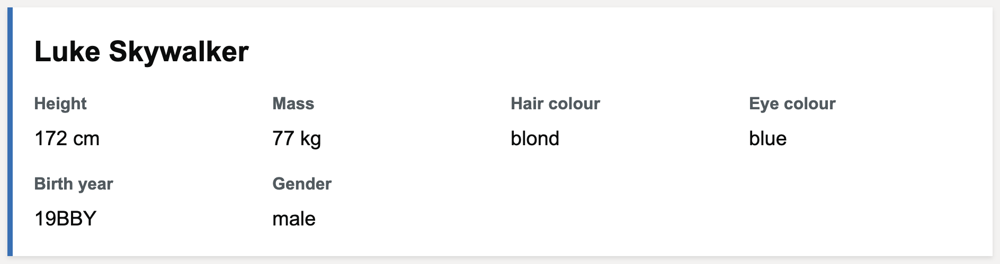
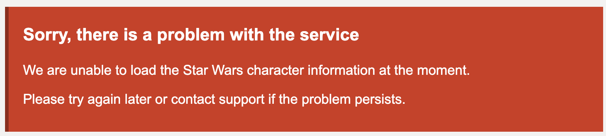

# F1.S1: Display Star Wars Character List

## Description

As a user,
I want to view a list of Star Wars characters with their detailed information,
so that I can browse and learn about different characters from the Star Wars universe.

## ACs

### Success

**Given** the Star Wars API is available \
**When** I navigate to the character list page \
**Then** I see a list of characters displayed \
**And** each character shows their name as a heading \
**And** each character shows height in centimeters \
**And** each character shows mass in kilograms \
**And** each character shows hair color \
**And** each character shows eye color \
**And** each character shows birth year \
**And** each character shows gender

### Error

**Given** the Star Wars API is unavailable or returns an error \
**When** I navigate to the character list page \
**Then** I see a user-friendly error message \
**And** I am provided with guidance on what to do next \
**And** the page does not crash or show technical error details

### Tech Notes

- Character list page should be at `/star-wars`
- Variable name: STAR_WARS_URL
- Required value: https://swapi.dev/api/people/

## Design/UX Considerations

### Character List Page

### Error Page

